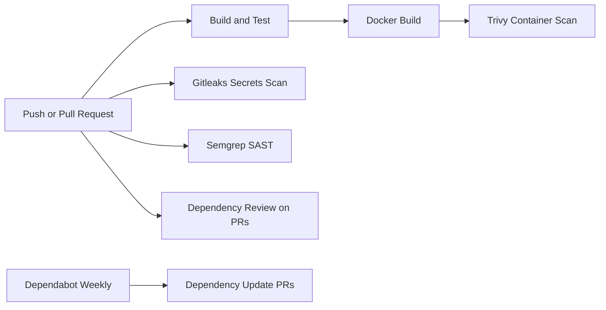

# Secure GitHub Actions Pipeline

A beginner-friendly DevSecOps portfolio project that demonstrates how to build a safer GitHub Actions CI/CD pipeline for a small Python web app.

This project focuses on CI/CD security, automated scanning, dependency monitoring, SAST, secrets detection, container vulnerability scanning, and least-privilege workflow design.

## Overview

The lab includes:

- A simple Flask web app
- Unit tests with `pytest`
- A Dockerfile for container builds
- GitHub Actions workflow for build and test
- GitHub Actions workflow for security scanning
- Secrets scanning with Gitleaks
- SAST with Semgrep
- Dependency review for pull requests
- Dependabot configuration
- Container vulnerability scanning with Trivy
- SBOM generation with Trivy
- Least-privilege workflow permissions
- Sanitized sample security report
- Documentation explaining each DevSecOps control

No real secrets, tokens, passwords, private keys, or cloud credentials are included.

## Folder Structure

```text
secure-github-actions-pipeline/
├── .github/
│   ├── dependabot.yml
│   └── workflows/
│       ├── ci.yml
│       └── security.yml
├── app/
│   ├── __init__.py
│   └── app.py
├── docs/
│   ├── devsecops-controls.md
│   └── sanitized-insecure-example.md
├── reports/
│   ├── .gitkeep
│   ├── sample-local-validation.txt
│   └── sample-security-report.txt
├── scripts/
│   ├── run-local-security.sh
│   ├── generate-sbom.sh
│   └── validate_app.py
├── tests/
│   └── test_app.py
├── .dockerignore
├── .gitattributes
├── .gitleaks.toml
├── .gitignore
├── .semgrepignore
├── Dockerfile
├── LICENSE
├── README.md
├── requirements-dev.txt
├── requirements-security.txt
└── requirements.txt
```

## Features

- Clean Flask app with `/`, `/health`, and `/security-controls`
- Unit tests for app behavior
- Docker image build for the app
- CI workflow with Python test and Docker build jobs
- Security workflow with secrets scanning, SAST, dependency review, and container scanning
- Explicit GitHub Actions permissions using least privilege
- Dependabot monitoring for Python, Docker, and GitHub Actions
- Sanitized insecure example for learning without exposing real secrets
- Sample security report for recruiter-friendly review

## Pipeline Diagram



## Installation

Create a virtual environment:

```bash
python -m venv .venv
```

Activate it:

```bash
source .venv/bin/activate
```

Windows PowerShell:

```powershell
.\.venv\Scripts\Activate.ps1
```

Install dependencies:

```bash
python -m pip install -r requirements-dev.txt
```

## Run The App Locally

```bash
python app/app.py
```

Open:

```text
http://127.0.0.1:8000
http://127.0.0.1:8000/health
http://127.0.0.1:8000/security-controls
```

Validate a running app:

```bash
python scripts/validate_app.py http://127.0.0.1:8000
```

## Run Tests

```bash
python -m pytest -q
```

## Build Docker Image

```bash
docker build -t secure-actions-demo:local .
```

Run the container:

```bash
docker run --rm --name secure-actions-demo -p 8000:8000 secure-actions-demo:local
```

## Local Security Scans

Install optional security tools locally:

```bash
python -m pip install -r requirements-security.txt
```

Run Semgrep:

```bash
semgrep scan --config p/python --config p/flask --config p/secrets --error
```

Run Gitleaks if installed:

```bash
gitleaks detect --no-git --source . --config .gitleaks.toml --redact
```

Docker alternative:

```bash
docker run --rm -v "$PWD:/repo" zricethezav/gitleaks:latest detect --no-git --source /repo --config /repo/.gitleaks.toml --redact --no-banner
```

Run Trivy if installed:

```bash
trivy image --scanners vuln --pkg-types os --severity HIGH,CRITICAL --ignore-unfixed --exit-code 1 secure-actions-demo:local
```

Or run the helper script:

```bash
bash scripts/run-local-security.sh
```

Generate a local CycloneDX SBOM after building the Docker image:

```bash
bash scripts/generate-sbom.sh secure-actions-demo:local
```

## GitHub Actions Workflows

### Build And Test

File: `.github/workflows/ci.yml`

Runs on pushes and pull requests to `main`.

Jobs:

- Python dependency installation
- Unit tests with `pytest`
- Docker image build

### Security Scans

File: `.github/workflows/security.yml`

Runs on pushes, pull requests, and manual dispatch.

Jobs:

- Gitleaks secrets scan
- Semgrep SAST scan
- Dependency review on pull requests
- Trivy container image scan for OS package vulnerabilities
- Trivy CycloneDX SBOM generation uploaded as a short-retention workflow artifact

The workflow uses read-only permissions by default and only grants job-level permissions where needed.

## Sample Output

A sanitized report is included at:

- [`reports/sample-security-report.txt`](reports/sample-security-report.txt)
- [`reports/sample-local-validation.txt`](reports/sample-local-validation.txt)

Example summary:

```text
[PASS] Secrets Scan - Gitleaks
[PASS] SAST - Semgrep
[PASS] Dependency Review
[PASS] Container Scan - Trivy
```

## Security Concepts Learned

This project demonstrates:

- CI/CD security fundamentals
- GitHub Actions workflow design
- Least-privilege workflow permissions
- Secrets detection
- SAST/static analysis
- Dependency review
- Dependabot dependency monitoring
- Container image vulnerability scanning
- Security gates that fail builds on serious findings
- Safe use of sanitized insecure examples

More detail:

- [`docs/devsecops-controls.md`](docs/devsecops-controls.md)
- [`docs/sanitized-insecure-example.md`](docs/sanitized-insecure-example.md)

## What I Struggled With

The main tradeoff was deciding how many security tools to include without making the pipeline feel inflated. I kept the app small and focused on controls I can explain: tests, secrets scanning, SAST, dependency review, Dependabot, Trivy, and least-privilege workflow permissions.

## Future Improvements

- Pin third-party GitHub Actions to full commit SHAs
- Upload SARIF results to GitHub code scanning
- Add branch protection rules requiring CI checks
- Add OpenSSF Scorecard
- Add Docker Scout or Grype as a second container scanner
- Add pre-commit hooks for local security checks
- Add OIDC examples for cloud deployments without long-lived credentials
- Add GitHub environments with required reviewers

## Disclaimer

This project is for educational and portfolio use. It is a safe learning lab and does not include real secrets or production credentials.

## References

- [GitHub Actions secure use reference](https://docs.github.com/en/actions/reference/security/secure-use)
- [GitHub Actions GITHUB_TOKEN permissions](https://docs.github.com/actions/reference/authentication-in-a-workflow)
- [GitHub Dependabot configuration](https://docs.github.com/en/code-security/how-tos/secure-your-supply-chain/secure-your-dependencies/configure-version-updates)
- [GitHub Dependency Review Action](https://github.com/actions/dependency-review-action)
- [Gitleaks](https://gitleaks.io/)
- [Semgrep](https://github.com/semgrep/semgrep)
- [Trivy GitHub Action](https://github.com/aquasecurity/trivy-action)
