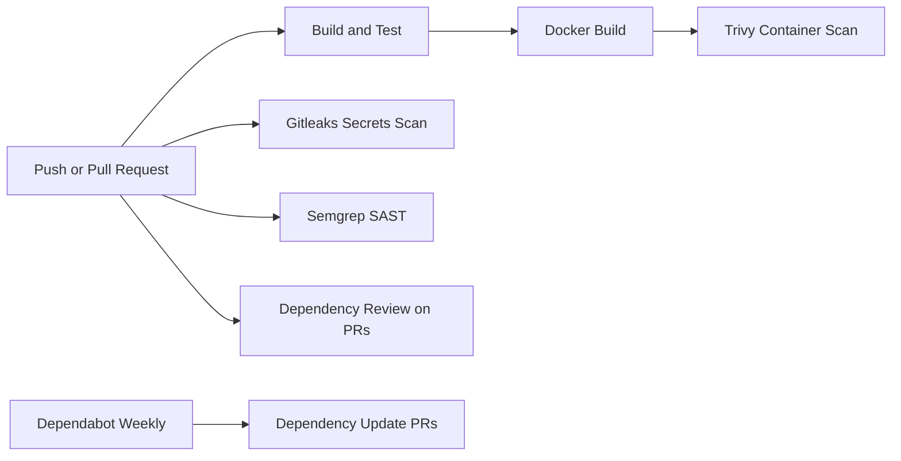

# DevSecOps Controls

This project demonstrates a layered secure CI/CD pipeline. Each control catches a different type of risk.

## Build And Test

Workflow: `.github/workflows/ci.yml`

The build and test workflow installs Python dependencies, runs unit tests, and builds a Docker image. This gives the team fast feedback that the app still works before security checks are reviewed.

Security value:

- catches broken changes early
- proves the app can be built from source
- creates a repeatable baseline for later security scans

## Least-Privilege Workflow Permissions

The workflows set `permissions: contents: read` by default. Jobs only request extra permissions when needed.

Security value:

- reduces what the workflow token can do
- limits blast radius if a workflow step is compromised
- makes permissions visible during review

## Secrets Scanning With Gitleaks

Workflow: `.github/workflows/security.yml`

Gitleaks scans the repository for committed secrets such as tokens, passwords, private keys, and API keys.

Security value:

- catches accidental credential commits
- helps stop secrets from reaching the default branch
- teaches why fake examples must be clearly marked and allowlisted

## SAST With Semgrep

Workflow: `.github/workflows/security.yml`

Semgrep scans source code for risky patterns. This project uses Python, Flask, and secrets rulesets.

Security value:

- catches insecure coding patterns before deployment
- gives developers line-level feedback
- demonstrates security-as-code

## Dependency Review

Workflow: `.github/workflows/security.yml`

Dependency review runs on pull requests and checks whether changed dependencies introduce known vulnerabilities or denied licenses.

Security value:

- blocks risky dependency changes before merge
- supports supply-chain security
- complements Dependabot alerts and version updates

## Dependabot

Config: `.github/dependabot.yml`

Dependabot checks Python packages, Docker base images, and GitHub Actions for available updates.

Security value:

- keeps dependencies current
- creates update pull requests for review
- reduces long-term patching debt

## Container Scanning With Trivy

Workflow: `.github/workflows/security.yml`

Trivy scans the built Docker image for operating system package vulnerabilities. The workflow fails on HIGH or CRITICAL OS package findings where a fix is available.

Security value:

- checks the artifact that would actually be deployed
- helps enforce vulnerability policy in CI
- shows the difference between source checks and image checks

Application dependency risk is handled by dependency review and Dependabot. This keeps the container gate focused on the operating system layer of the image while the Python dependency controls focus on the application layer.

## Pipeline Diagram

